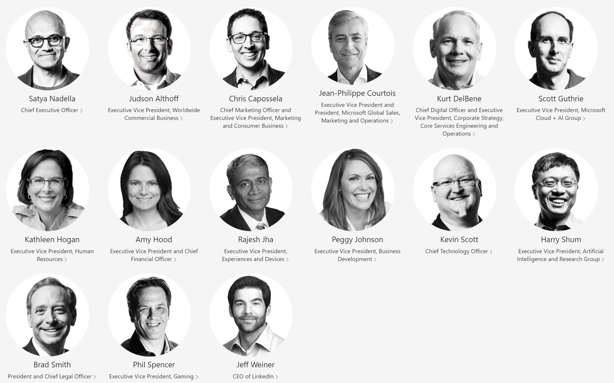
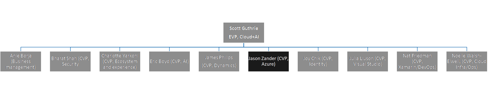
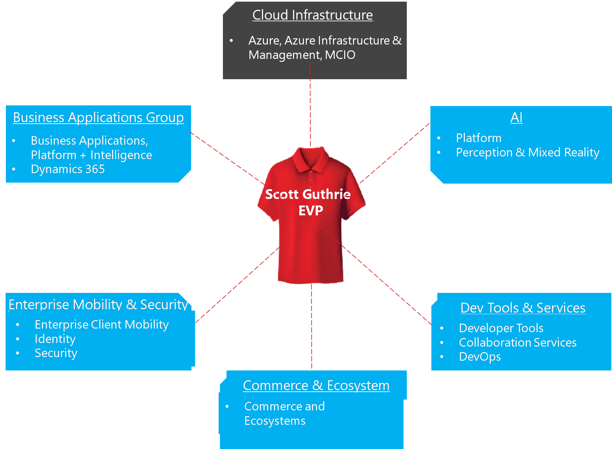
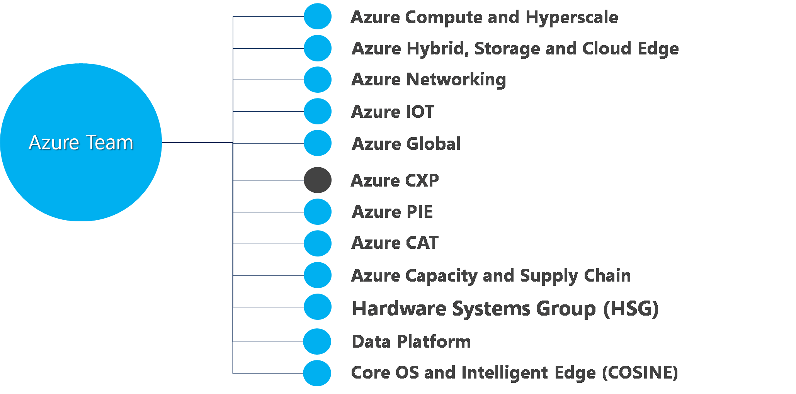

# Microsoft Organizational Structure

>## Microsoft leadership team

>## Cloud + AI Leadership and Structure

Cloud+ AI covers most of Microsoft's Business Applications and Cloud Services. The FTA team is part of the Azure Customer Experience Engineering (CXP) team, which in turn is part of the Azure engineering organization.

Who leads cloud and AI services at Microsoft?

What is the Azure infrastructure?

How is the Azure team organized?

-----
**Who is in the Microsoft's leadership team?**

Go to [Microsoft Leadership team](https://github.com/Azure/fta-playbook/blob/development/ftaplaybook/playbook/Welcome/Microsoft_Organizational_Structure.md#microsoft-leadership-team)

**What is the Cloud + AI Leadership structure?**

Go to [Cloud + AI](https://github.com/Azure/fta-playbook/blob/development/ftaplaybook/playbook/Welcome/Microsoft_Organizational_Structure.md#cloud--ai-leadership-and-structure)

**Who owns the Microsoft Organizational Structure playbook area?**

[Dashleen Bhandari](mailto:dabhan@microsoft.com)
