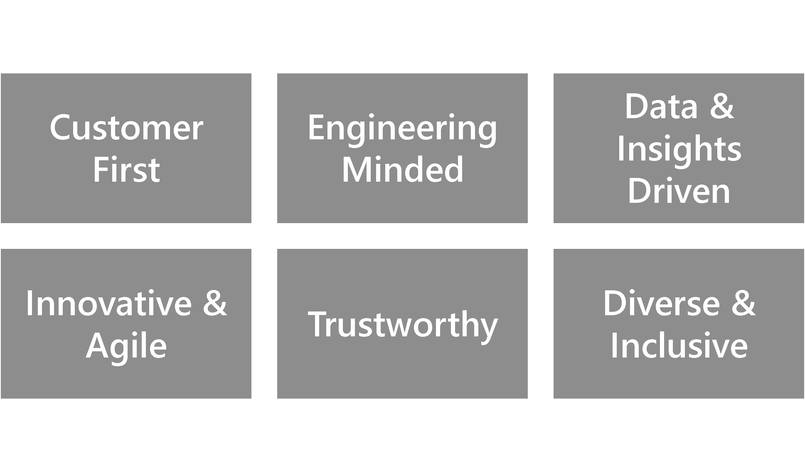
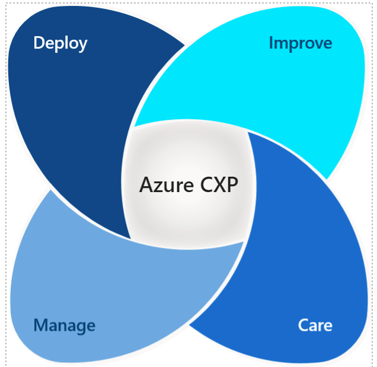
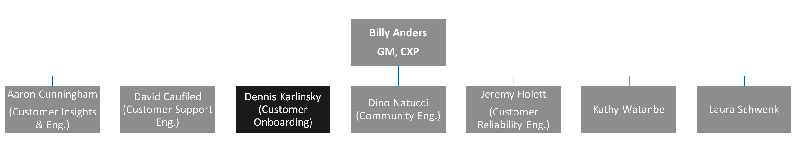

# Welcome to CXP

**The community team is part of the Azure Customer Experience Engineering (CXP) team, which in turn is part of the Azure Engineering organization.**

## Azure Customer Experience Engineering (CXP) Mission and Purpose

Azure Customer Experience Engineering Team is committed to transform Azure customers into Azure fans. It is aims to drive customer success and growth through world class customer engineering engagement and continuous product improvements.

>## CXP Principles

Read the [Azure CXP Charter](https://microsoft.sharepoint.com/:w:/t/AzCXP/EQa0YmpdciZJpAkcYRTjN6UBJqa3Gjj1PEDYI19LPw6zrQ?rtime=_u9pgztw1kg) and [CXP All Hands Deck](https://microsoft.sharepoint.com/:f:/t/AzCXP/EiH88M9pvEVHv37sdGe2I24B_ZlpnYk3J00SPKhK8d_3Ew?e=hYUUc7)

## CXP Goals

|Satisfaction  |Consumption  |Reliability  |
|---------|---------|---------|
|Drive world-class NSAT and NPS for Azure| Drive, unblock and enable 80%+ utilization across Azure core engineering engaged customers| Drive, unblock and enable 80%+ utilization across Azure core engineering engaged customers|

<!--

If you need any help with editing these tables, please contact [Thomas Martinez](mailto:Thomas.Martinez@microsoft.com)

-->

>## CXP Pillars

**DEPLOY:** (Also known as Customer Onboarding and Growth) This team is led by Dennis Karlinsky, engaging directly with new-to-cloud and born-in-cloud customers seeking to establish their Azure footprint, assist in acceleration to production the solutions and workloads that best fit their business goals. Team focuses on end-to-end assistance – from planning to design to production – on deploying secure, scalable, and resilient solutions.

**MANAGE:** (Also known as Customer Reliability Engineering) This team is led by Jeremy Hollett, providing expert guidance on workload reliability and resilience at scale to customers seeking to expand their Azure footprint. By simplifying the complexities of Azure resources and processes, the team enables our global customers and field partners to leverage the latest Azure technologies and modernize their workloads

**CARE:** (Also known as Customer Support Engineering) This team is led by David Caufield which cares for customers throughout their Azure journey by anticipating and responding to roadblocks they face. We deliver engineering-led customer care, build customer-centered product experiences, and drive customer care culture into engineering teams across the Azure business

**IMPROVE:** (Also known as Customer Insights and Engineering) This team is led by Aaron Cunningham which strives to make Azure better by collecting and acting on customer and partner feedback across all stages of the customer life cycle, all customer segments, and all Azure products

In a reorg late Dec 2018, the Support Experience and Platform team was integrated with the Azure CXP team, which makes it easy for Azure service teams and CSS to turn Azure customers into fans by helping them quickly overcome impediments and avoid preventable problems.

More details - [here](https://microsoft.sharepoint.com/:p:/t/AzCXP/Ef8dnIjDa5xKuD7_5VurnSIBCblwu8dswkJPpr3HustQ7Q?e=7HrPbE)

>## CXP Customer Programs (not an exhaustive list)

- [Azure Documentation](https://microsoft.sharepoint.com/teams/AzCXP/SitePages/Azure-Documentation.aspx?web=1) - Support, updates and managing comments for all Azure documentation
- [Azure Forums](https://microsoft.sharepoint.com/teams/AzCXP/SitePages/Azure-Forums.aspx?web=1) - Manage and support our presence in Microsoft branded and third party forums
- FastTrack for Azure - that's us :)
- [Hi-Priority Events](https://microsoft.sharepoint.com/teams/Azure_High_Priority_Events_Program_Portal/SitePages/Home.aspx?web=1%20) - Deep customer engagement ​program​ that aids in the design, platform awareness, escalation management, and support readiness for Azure's most important customer events
- [GetHelp](https://microsoft.sharepoint.com/teams/Advocacy/Pages/Splash.aspx) - Facilitates navigation to the right resolution channel to quickly address customer, partner, and field related issues
- [Pulse Program](https://microsoft.sharepoint.com/teams/AzCXP/SitePages/Pulse.aspx?web=1) - Deep engagement with our most strategic customers
- [PSAT Program](https://microsoft.sharepoint.com/teams/AzCXP/SitePages/PSAT-Program.aspx?web=1) - Survey program tracks & provides Azure all-up customer experience measurement & insights with quantitative data and compete benchmarking
- [T 100](https://microsoft.sharepoint.com/teams/AzCXP/SitePages/T100-Support.aspx?web=1) - provide active and deep engagement for our most critical Azure customers

>## CXP Org Structure (as of Dec. 2018 - Support Experience and Platform pillar changes pending)

To learn more, browse the [CXP SharePoint](https://microsoft.sharepoint.com/teams/Azure) and view the [CXP walking deck.](https://microsoft.sharepoint.com/:p:/r/teams/AzCXP/_layouts/15/Doc.aspx?sourcedoc=%7B93F3412A-5497-472A-AF50-0C69A49FDAF5%7D&file=CXP_Master.pptx&action=edit&mobileredirect=true)

-----

**What are the Principles of CXP?**

Go to [CXP Principles](https://github.com/Azure/fta-playbook/blob/master/ftaplaybook/playbook/Welcome/Welcome_to_CXP.md#cxp-principles)

**What are CXPs goals?**

Go to [CXP Goals](https://github.com/Azure/fta-playbook/blob/master/ftaplaybook/playbook/Welcome/Welcome_to_CXP.md#cxp-goals)

**What are the Pillars of CXP?**

Go to [CXP Pillars](https://github.com/Azure/fta-playbook/blob/master/ftaplaybook/playbook/Welcome/Welcome_to_CXP.md#cxp-pillars)

**What are some CXP Customer programs?**

Go to [CXP Customer Programs](https://github.com/Azure/fta-playbook/blob/master/ftaplaybook/playbook/Welcome/Welcome_to_CXP.md#cxp-customer-programs-not-an-exhaustive-list)

**How is the CXP organization structured?**

Go to [CXP Org Structure - Dec. 2018](https://github.com/azure-cxp-community/cxp-playbook/blob/master/cxpplaybook/playbook/Welcome/Welcome_to_CXP.md#cxp-org-structure-as-of-dec-2018---support-experience-and-platform-pillar-changes-pending)

